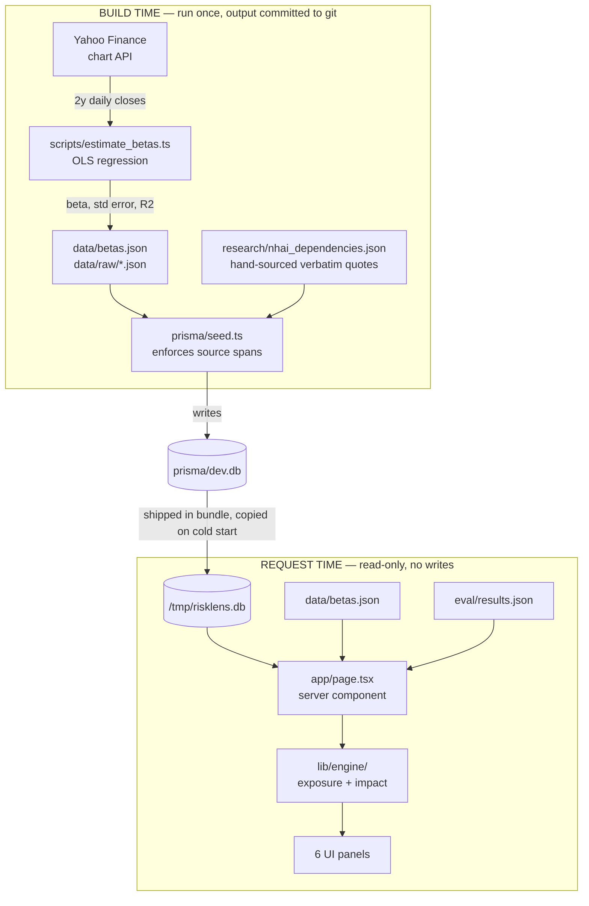
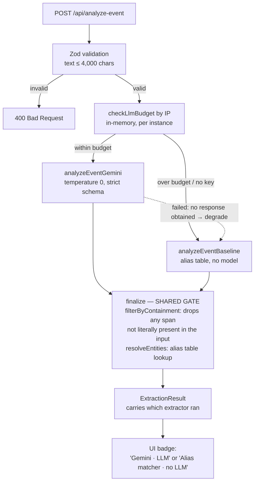
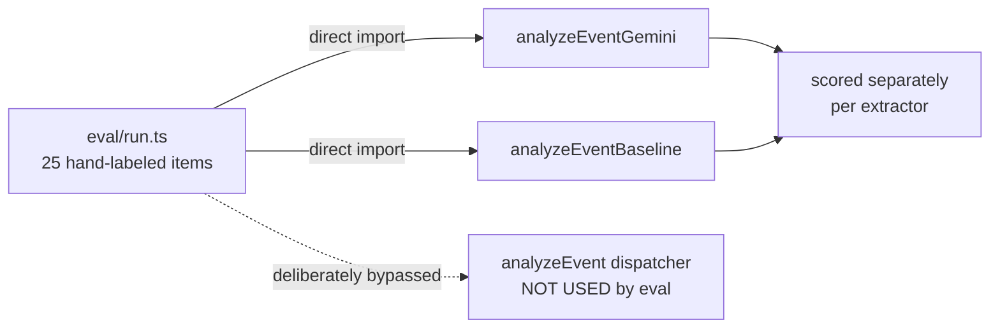

# RiskLens — Architecture

A counterparty-exposure tool built around one constraint: **nothing that reaches the screen may be invented
at request time.**

---

## The central split

Every expensive or unverifiable operation — fetching market data, regressing betas, sourcing quoted
dependencies — happens *before* deployment and is committed to the repository. At request time the
application only reads.

This isn't a performance decision. It's what makes the numbers auditable: the regression inputs, the
regression output, and the database are all in git, so any figure on screen traces back to a committed file
and can be recomputed. It's also what lets SQLite work on a read-only serverless filesystem at all.

**The database is a build artifact, not a live store.** Because nothing writes at request time, the
pre-seeded SQLite file can ship inside the deployment bundle and be copied to `/tmp` on cold start — the only
writable path in Vercel's runtime.

---

## Layers

| Layer | Responsibility |
|---|---|
| `scripts/` + `research/` | Data generation. Two years of daily closes → log returns → OLS against NIFTY 50 and NIFTY Infrastructure, emitting coefficients with standard errors and R². Raw closes are committed alongside the output so the regression can be recomputed by hand rather than taken on trust. |
| `prisma/` | Persistence. Four tables: Position, Counterparty, Dependency, Shock. The seed is driven entirely by the research JSON — counterparties are created from what that file declares, so adding a second one is a data edit, not a code change. |
| `lib/engine/` | Calculation. Two pure functions over plain data, no I/O. They import Prisma *types* but never the client, so the same code runs on the server and in the browser for the live shock slider. |
| `lib/extract/` | Entity extraction. Two interchangeable extractors behind one dispatcher, sharing a single validation gate. |
| `app/` | Interface. A server component reads the database and both JSON files per request (`force-dynamic`). Only three components are client-side — the shock slider, the event box, and the graph — because only those need interactivity. |

### The enforced write path

`lib/dependencies.ts` is the **only** write path for dependency rows, and it throws when the source span is
empty. "No quote, no row" is enforced in the insert path rather than left as a convention for callers to
remember.

---

## The extraction path

This is the only place a language model touches the system, and its job is deliberately narrow: extract
entity names and link them to holdings. It never receives portfolio values, and the response schema contains
no numeric field for it to populate.

**The safety check sits below the branch, not inside either extractor.** Both paths converge on the same
containment filter and alias resolution, so a fabricated span cannot reach the UI regardless of which
extractor produced it — and swapping the model can't accidentally bypass the check.

The dotted edge is the degradation path: a model that couldn't be reached at all hands the request to the
baseline rather than returning an error. See [Degradation](#degradation-and-a-gap-that-used-to-be-here).

---

## Why the benchmark bypasses all of this

The evaluation harness imports the two extractors directly and never calls the dispatcher.

**Routing the benchmark through the dispatcher would silently corrupt it.** A rate-limited item would return
baseline results and be scored as the model's — quietly deflating one extractor and inflating the other, with
nothing in the output to indicate it happened.

The same principle governs how failures are counted: a quota error means no response was obtained and says
nothing about extraction quality, so those items are excluded from the quality metrics and reported as
`errorRate` / `coverage`. Only a model that was actually reached and declined counts toward `abstentionRate`.

---

## Degradation, and a gap that used to be here

Earlier versions only fell back to the baseline on the *pre-emptive* budget check. If Gemini was actually
called and then failed — a real 429, a timeout, a network error — the failed result was passed straight
through, and the user saw *"Could not analyse: Extraction failed: 429…"*.

That meant the budget guard covered the failure it predicted but not the one that actually happens, which
was the wrong way round: the in-memory limiter barely fires in production (Vercel routes consecutive
requests to different instances — measured, four requests hit four distinct instances), so a genuine quota
exhaustion was the likely path, and it was the unhandled one.

Both paths now degrade. The dispatcher inspects `result.failed` after the model call and falls through to
the baseline with a note naming the cause. The distinction that matters is preserved:

- **Reached and declined** → a real answer, kept as an abstention.
- **Never reached** (quota, timeout, network) → not an answer, so the deterministic extractor serves the
  request instead, labelled.

The result is that no single failure can produce an error screen for a visitor — the worst case is a visibly
downgraded answer.

---

## Deployment

Next.js on Vercel, with three adaptations the default setup doesn't handle:

| Adaptation | Where | Why |
|---|---|---|
| `/tmp` copy on cold start | `lib/db.ts` | SQLite wants a writable directory beside its file even for pure reads, so the committed snapshot is copied to `/tmp` and Prisma is pointed at the copy. |
| Output file tracing | `next.config.ts` | Next's bundler can't see through `readFileSync`, so `prisma/dev.db`, `data/betas.json` and `eval/results.json` are declared in `outputFileTracingIncludes`. Without it they're absent from the bundle and the page renders silently empty. |
| Extra engine target | `prisma/schema.prisma` | `rhel-openssl-3.0.x` alongside `native`, since the query engine binary that runs locally isn't the one Vercel's Linux runtime needs. |
